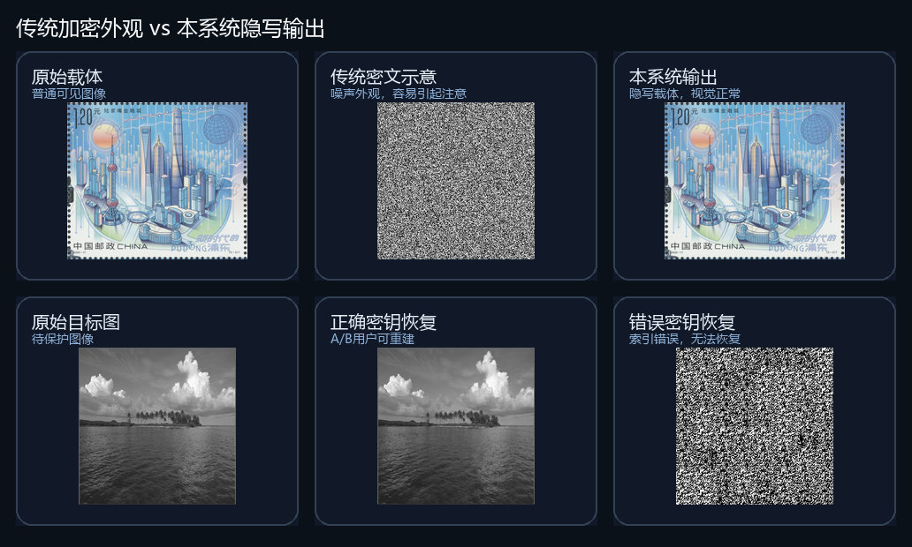

# AMP-CS 多级图像安全传输 Demo

基于压缩感知、DCT 域隐写、AMP-Net 重建和 AI 隐私保护的多级图像安全传输原型系统。项目面向大学生创新创业训练计划结项答辩展示，重点证明一条完整的软件 demo 链路：多幅图像被压缩测量并隐藏进视觉正常的载体图像中，不同权限用户可恢复不同层级的内容。



## 项目亮点

- **视觉隐蔽传输**：输出不是明显噪声密文，而是接近普通图片的隐写载体。
- **压缩感知降维**：先对图像分块生成压缩测量值，降低需要隐藏的数据规模。
- **分级访问控制**：访客只能看到载体图，A 用户恢复目标图，B 用户/管理员恢复源图和目标图。
- **AMP-Net 重建**：使用学习型展开网络从测量值中恢复图像，提高 demo 展示质量。
- **AI 隐私保护**：可结合 YOLO 对低权限视图中的敏感区域进行检测和马赛克处理。
- **纯 Python 桌面端**：核心 demo 不依赖 MATLAB，使用 CustomTkinter 提供图形界面。

## 仓库结构

```text
.
├── main_app.py                 # 桌面端登录入口
├── run_demo_experiments.py     # 生成答辩用对比图和实验指标
├── amp_self_check.py           # AMP 重建链路自检脚本
├── ai_modules/                 # YOLO 检测、ROI 分析、隐私保护
├── core/                       # 加密、解密、权限控制流程
├── cs_crypto/                  # 压缩测量、置乱、DCT 隐写等算法模块
├── gui/                        # CustomTkinter 图形界面
├── net/                        # AMP-Net 主网络结构和数据处理脚本
├── docs/                       # 答辩说明和展示图片
└── requirements.txt            # Python 依赖
```

## 本地运行

建议使用 Python 3.9 或 3.10。GPU 不是必须项，但安装 PyTorch/CUDA 后重建速度会更好。

```bash
python -m venv .venv
.venv\Scripts\activate
pip install -r requirements.txt
python main_app.py
```

演示账号仅用于本地 demo：

| 角色 | 用户名 | 密码 | 可见内容 |
| --- | --- | --- | --- |
| 访客 | 无 | 无 | 仅查看隐写载体图 |
| A 用户 | `a` | `123` | 恢复目标图，低权限隐私保护 |
| B 用户 | `b` | `456` | 恢复源图和目标图 |
| 管理员 | `admin` | `root` | 完整访问 |

## 模型和数据说明

为了让公开仓库保持轻量，以下文件不会上传到 GitHub：

- `models/`：AMP-Net 权重、YOLO 权重等模型文件。
- `dataset/`、`net/dataset/`：采样矩阵和本地数据。
- `output/`：实验输出、结项书、PDF、临时 Word 文件。

本地完整 demo 需要准备：

```text
models/best_model (1).pkl
models/best.pt                  # 可选，用于 YOLO 隐私检测
dataset/sampling_matrix/60.mat
```

如仅阅读代码或查看答辩材料，不需要下载这些大文件。

## 实验结果

当前结项演示中的主要结果如下：

| 实验项 | 指标 | 当前结果 | 说明 |
| --- | --- | --- | --- |
| 目标图重建质量 | PSNR / SSIM | 36.22 dB / 0.9591 | 正确密钥下 AMP 重建目标图 |
| 源图重建质量 | PSNR / SSIM | 34.62 dB / 0.9459 | B 用户恢复源图 |
| 隐写载体质量 | Carrier PSNR / SSIM | 51.15 dB / 0.9985 | 隐写前后视觉差异较小 |
| 错误密钥恢复 | Wrong-key PSNR / SSIM | 5.61 dB / 0.0027 | 错误索引下无法有效恢复 |
| 端到端效率 | 总耗时 / 加密 / A 重建 / B 重建 | 6.92s / 4.30s / 1.49s / 0.58s | 满足本科项目 demo 展示 |

生成答辩展示图和实验表：

```bash
python run_demo_experiments.py
```

脚本默认读取桌面端 demo 生成的输入图片；也可以通过 `--input-dir` 和 `--output-dir` 指定目录。

## 答辩展示建议

1. 先展示访客视图：载体图视觉正常，看不出隐藏了多幅图像。
2. 切换 A 用户：展示目标图恢复和 AI 隐私保护。
3. 切换 B 用户：展示源图和目标图均可恢复。
4. 展示错误密钥恢复失败：说明置乱索引和密钥敏感性。
5. 最后展示实验指标表：从重建质量、隐写不可感知性和运行效率三个角度闭环说明。

## 公开范围

本仓库是答辩展示版，保留核心代码、算法模块、实验脚本和展示材料。结项书正文、模型权重、完整输出结果和本地临时文件不进入公开仓库。

## License

暂未选择正式开源许可证。当前仓库主要用于课程/大创项目展示；如后续作为正式开源项目发布，建议补充 `LICENSE` 文件并确认学校或团队对成果公开的要求。
