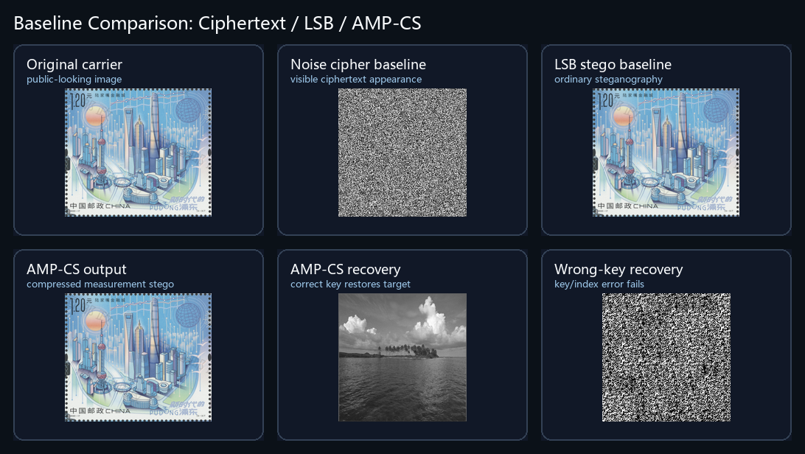

# Baseline 对比说明

本页用于结项答辩中的“与基线方法对比”页。所有指标均由仓库脚本 `run_baseline_comparison.py` 生成，输入来自同一组 demo 结果图：`output/demo_experiments`。

## 对比口径

| 方法 | 对比角色 | 样本 | 载体 PSNR / SSIM | 恢复 PSNR / SSIM | 熵 | 参考依据 | 说明 |
| --- | --- | ---: | ---: | ---: | ---: | --- | --- |
| Noise-cipher baseline | 传统密文外观 | 3 张目标图 | - | 8.48 / 0.0079 | 8.00 | NIST FIPS 197, AES | 用随机噪声外观模拟传统图像密文的可见特征，不比较密码强度 |
| LSB steganography baseline | 经典单图隐写 | 3 张目标图逐张嵌入 | 62.40 / 0.9997 | - | 7.30 | Chan & Cheng, Pattern Recognition, 2004 | 载体扰动极小，但该行只作为普通隐写载体不可感知性对照，不参与恢复质量比较 |
| AMP-CS system | 本系统 | 3 张目标图 | 51.15 / 0.9985 | 36.22 / 0.9591 | 7.30 | Candes et al., 2006; Donoho, 2006; 本项目实现 | 在保持载体视觉自然的同时，支持压缩测量、DCT 域隐写和授权恢复 |
| AMP-CS wrong-key ablation | 错误密钥消融 | 3 张目标图 | - | 5.62 / 0.0027 | 1.89 | 本项目消融实验 | 错误置乱索引下恢复失败，说明密钥和索引具有敏感性 |

## 可放入 PPT 的结论

与传统密文外观相比，本系统输出为视觉正常的载体图，降低了密文外观带来的额外关注风险。与经典 LSB 隐写相比，LSB 在载体不可感知性上更高，但只能作为单图嵌入基线，缺少压缩测量、分级权限和错误密钥验证机制。本系统的载体 PSNR 仍达到 51.15 dB、SSIM 为 0.9985，同时三张目标图平均恢复 PSNR 达到 36.22 dB、SSIM 为 0.9591，说明系统在隐蔽性和授权恢复质量之间取得了较好的平衡。

## 参考文献

1. NIST, *Advanced Encryption Standard (AES)*, FIPS 197, 2001, updated 2023. https://doi.org/10.6028/NIST.FIPS.197-upd1
2. C. K. Chan and L. M. Cheng, "Hiding data in images by simple LSB substitution," *Pattern Recognition*, 37(3), 469-474, 2004. https://doi.org/10.1016/j.patcog.2003.08.007
3. E. J. Candes, J. Romberg and T. Tao, "Robust uncertainty principles: exact signal reconstruction from highly incomplete frequency information," *IEEE Transactions on Information Theory*, 52(2), 489-509, 2006. https://doi.org/10.1109/TIT.2005.862083
4. D. L. Donoho, "Compressed sensing," *IEEE Transactions on Information Theory*, 52(4), 1289-1306, 2006. https://doi.org/10.1109/TIT.2006.871582
