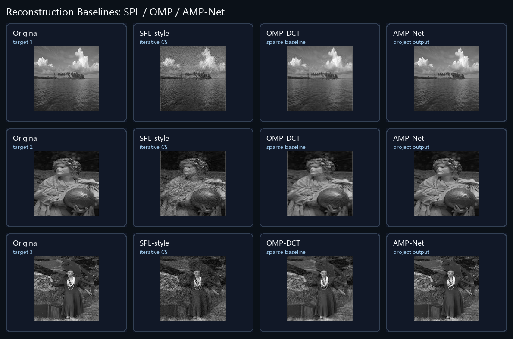

# SPL / OMP / AMP-Net 重建对比

本页用于说明为什么项目使用 AMP-Net 替换传统压缩感知重建算法。对比脚本为 `run_reconstruction_baselines.py`，输入为同一批目标图，采样矩阵为 `dataset/sampling_matrix/60.mat`，压缩率为 60%，分块大小为 33 x 33。

## 指标结果

| 方法 | 条件 | 总时间 | 平均时间/图 | PSNR | SSIM | 说明 |
| --- | --- | ---: | ---: | ---: | ---: | --- |
| SPL-style | 80 次迭代，DCT 阈值约束 | 1.80s | 0.60s | 22.09 | 0.4889 | 传统迭代式 CS 重建，速度尚可但细节噪声明显 |
| OMP-DCT | 每块最多 60 个 DCT 原子 | 44.94s | 14.98s | 28.17 | 0.7830 | 经典稀疏重建 baseline，质量优于 SPL-style，但耗时较高 |
| AMP-Net | 本项目模型输出，9 个 phase | 1.49s | 0.50s | 36.22 | 0.9591 | 恢复质量和速度综合表现最好，适合项目实时 demo |

## 可放入 PPT 的结论

在相同目标图、相同 60% 采样矩阵和相同分块条件下，传统 SPL-style 重建的平均 PSNR 为 22.09 dB、SSIM 为 0.4889，图像细节和纹理噪声较明显；OMP-DCT 的恢复质量提升到 28.17 dB、0.7830，但平均每张图耗时约 14.98s，不适合演示中的快速恢复。AMP-Net 的平均恢复质量达到 36.22 dB、0.9591，平均恢复时间约 0.50s，说明学习型重建网络在本项目场景下同时提升了恢复质量和交互效率。

## 答辩表述

我们原来考虑使用传统 SPL/OMP 一类压缩感知重建算法，但这类算法主要依赖迭代优化或逐块稀疏匹配。实验中，在相同采样矩阵和同一批目标图上，SPL-style 恢复速度接近 AMP-Net，但恢复质量明显不足；OMP-DCT 恢复质量更好，但耗时显著增加。因此项目最终采用 AMP-Net 作为重建模块，使系统既能保持较高恢复质量，也能满足网页端和桌面端 demo 的快速交互需求。
